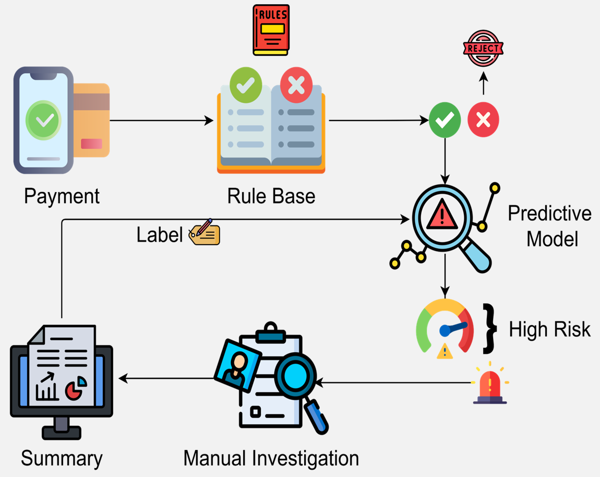

## Background for the system

The system is designed to automate the process of fraud investigation and reporting. 

*Figure 1: A typical fraud detection and investigation workflow.*

In a typical financial workflow, banks and card networks rely on rule-based systems and predictive models to evaluate transactions and assign them risk scores. When a transaction exceeds a specific risk threshold—or is selected via random sampling to help discover unseen threats—an alert is flagged for review. 

Traditionally, this requires a **human fraud analyst** to step in and manually investigate the alert. These manual investigations are a critical component of the security pipeline because they are essential for:
* **Identifying Emerging Threats:** Uncovering new, complex fraud patterns (such as Card Testing, Geographic Displacement, or High-Velocity Volume Spikes) that existing detection models might miss.
* **Stakeholder Reporting:** Providing clear, detailed case explanations for law enforcement and internal review teams.
* **Compliance and Trust:** Ensuring strict adherence to financial regulations and maintaining overall customer trust.
* **Model Retraining:** Generating the newly labeled data necessary to continuously update and improve primary fraud detection models.

However, manual review is a significant bottleneck. It is resource-intensive, time-consuming, and struggles to scale alongside high transaction volumes. 

**Our system addresses this exact problem.** By serving as an automated Fraud Investigation Agent (FIA), it takes over the manual review process. It autonomously investigates flagged alerts, analyzes the underlying transaction data for complex patterns, and generates comprehensive, stakeholder-ready reports. This drastically reduces the cognitive load and manual overhead on human analysts while preserving the thoroughness required for compliance and continuous system improvement.

## Information for the Reviewer
Currently we did not provide the code for the system, but we provided the prompts used to generate the investigation and the report.
We will release the full code for the system with acceptence of the paper.
For now we provided an investigation output of the FIA, which includes the investigation and the generated report.

## Prompts
The prompts are located in the `prompts` folder. 
The prompts are seperated into two categories: `pipeline` and `evaluation`.
The `pipeline` prompts includes all agents necessary to generate the investigation and the report, while the `evaluation` prompts are used to evaluate the efficiency of the system.

## Investigation Output
The investigation output is located in the `investigation_output` folder.

## Images folder
This folder selected interasting images from the investigation outputs. 
The images included interasting fraud patterns found during the investigations including: Card Testing, Geographhic Displacment, and High-Velocity Volume Spike.
